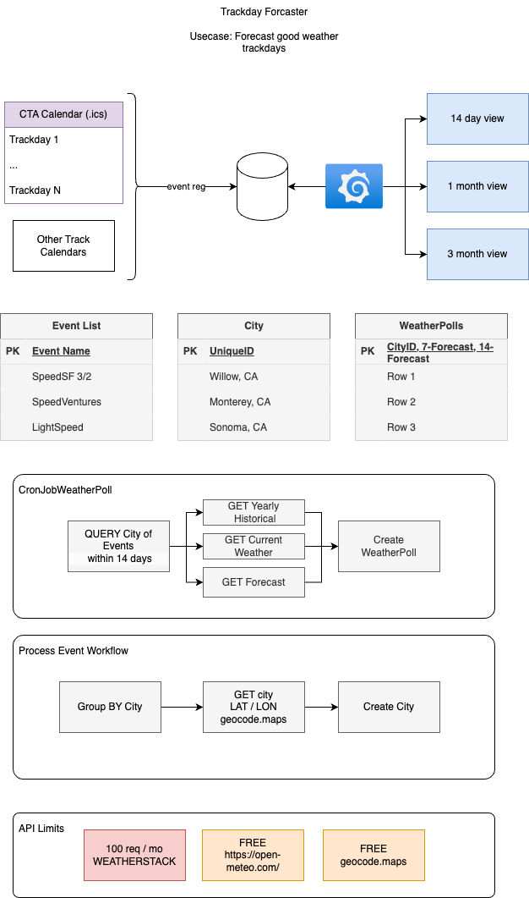

# Racing Event / Weather Dashboard

## Overview

This project is a dashboard for visualizing racing event data and weather forecasts. The data processing is done in Go, and Grafana is used to visualize the dashboards.

## Features

- Fetch and display weather forecasts for racing events.
- Parse and process racing event data from ICS files.
- Pretty print JSON responses for better readability.
- Visualize data using Grafana dashboards.

## Project Structure
```
/Users/tinhnguyen/workspace/sun/ 
├── go.mod 
├── main.go 
├── utils.go 
├── weather.go 
├── cta_event_cal.ics 
└── README.md
```

### Prerequisites

- Go 1.24.1 or higher
- Grafana
- Weatherstack API key

### Installation

1. Clone the repository:

```sh
git clone https://github.com/yourusername/sun.git
cd sun
```

2.  Install Go dependencies
```sh
go mod tidy
```

3. Set up your env vars
```sh
export WEATHERSTACK_API_KEY="your_weatherstack_api_key"
```

## Diagram





## Usage
### Fetch Weather Forecast
The WeatherForecast function fetches the weather forecast for a specified location and prints the pretty-printed JSON response.

### Parse Racing Event Data
The cal function parses racing event data from an ICS file and prints event properties such as summary, start date, end date, status, and location.

### Pretty Print JSON
The PrettyPrint function takes a JSON byte array and returns a pretty-printed JSON string for better readability.

## Contributing
Contributions are welcome! Please open an issue or submit a pull request for any improvements or bug fixes.

## License
This project is licensed under the MIT License. See the LICENSE file for details.

